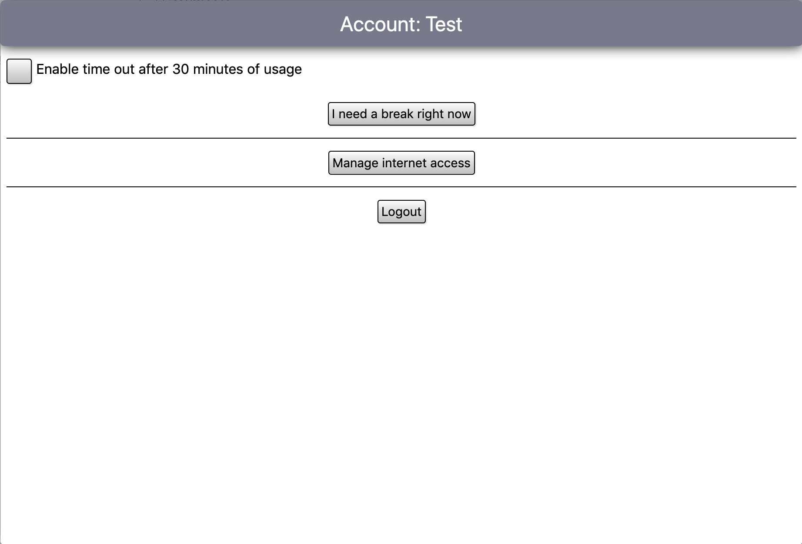

# Version 0.15.0 Changelog
This version of Kalzit is kind of interesting. Recently, I decided that I wanted to finish this project after working on it for a while.
So I made a plan with the things I wanted to add before publishing the first "finished" Kalzit version.
This version includes some of these. A lot of the changes made are really substantial, as you will see if you continue reading.

## Server optimization
As mentioned in many of the other changelogs, Kalzit is home-server software. Two really important aspects of this are security and speed, both of which have been imporoved in this version.
Here is a list of improvements:

### Dedicated "root" folder
In previous versions, the entire Kalzit root folder - every source file and everything else in there - was accessible via the server.
The only exception were files that you could put on a blacklist. This does not sound too bad, but there were two main problems: the server had to check the blacklist every time a file is requested, in order to see if it should serve it.
It was also really easy to just forget to put an important file on the blacklist - well, now everyone could have seen it! Not great for security.

In this version, both of these problems were solved by the addition of a dedicated `serverRoot` folder. The server does now only serve files in that folder, which means it acts as a whitelist (the opposite of a blacklist). You can now very easily see if a file is accessible via the server - simply check the `serverRoot` folder and see if it is in there. This approach is both safer and faster to execute, so it is definitely a good thing.

### Speed improvements
A few other things were done to increase server performance. Some other improvements were made as well - here is a list of them:

* Removed unused code from api/loginUser/index.ks
* The loginUser server API does now store the session as a symbolic link to the user home folder
* Removed the userArchive server API (never used)
* Updated the logout API to actually delete the session

## UI improvements (domain control!)

Another area I worked on is the UI. Specifically, an attempt was made to make every app built with Kalzit more privacy-focused, without more work for you or the developer of the app.

Basically, whenever an app wants to access a website (using `uiShowWebpageUrl` or `loadGlobalAsync`, for example), you will be prompted if you want to allow a request to that website. If the app wants to show a YouTube video, you will be asked if you really want to allow access to `youtube.com`. You can confirm or not, it is up to you.

These allowed websites are linked to your Kalzit account, and you can manage them by clicking on the "Manage internet access" button in your account panel:

A few other things were done as well:

* Removed rounding of element inside of viewpickers for Safari
* Updated the `<code>` tag styling (for Safari)
*  Added a way to remove accepted domains

## Updated publishing system
This last one is actually a rather big change to the (relatively new) publishing system, which is a way to allow tinkering without the risk of breaking everything.
I do not want to type out every change here, because I already did that elsewhere. If you want to learn more about the current state of the publishing system, [click here to get to the full documentation](../projectInstallationLevelsPublishing.md).

## End

You made it through this changelog - yay! I hope you like the new features and changes. If you have any suggestion or problem, feel free to open an Issue on GitHub. Thank you :)
